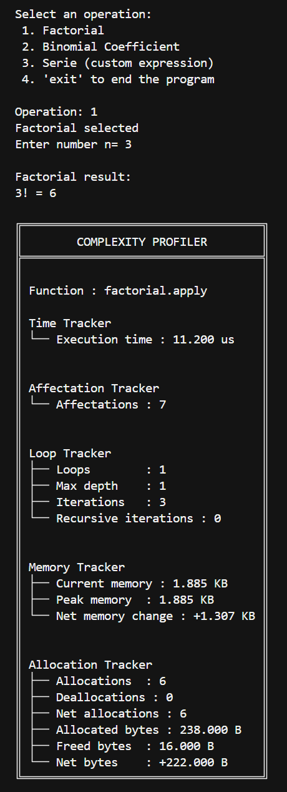
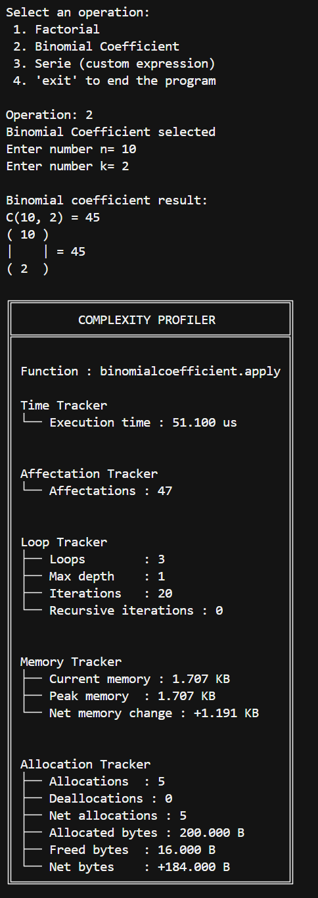
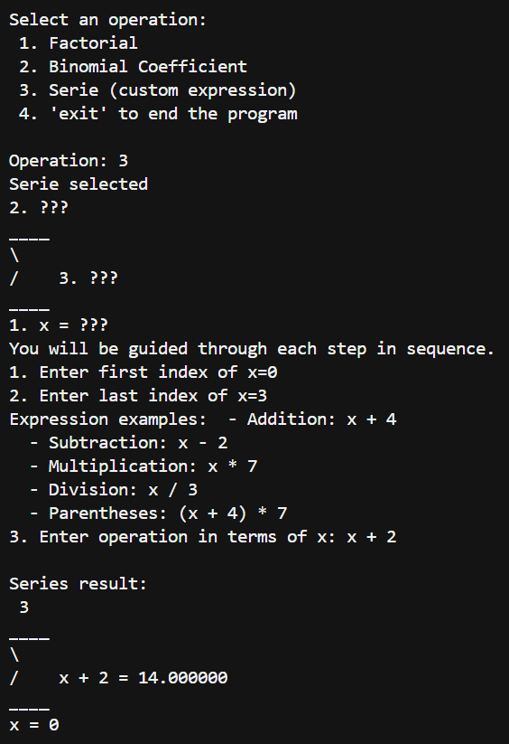
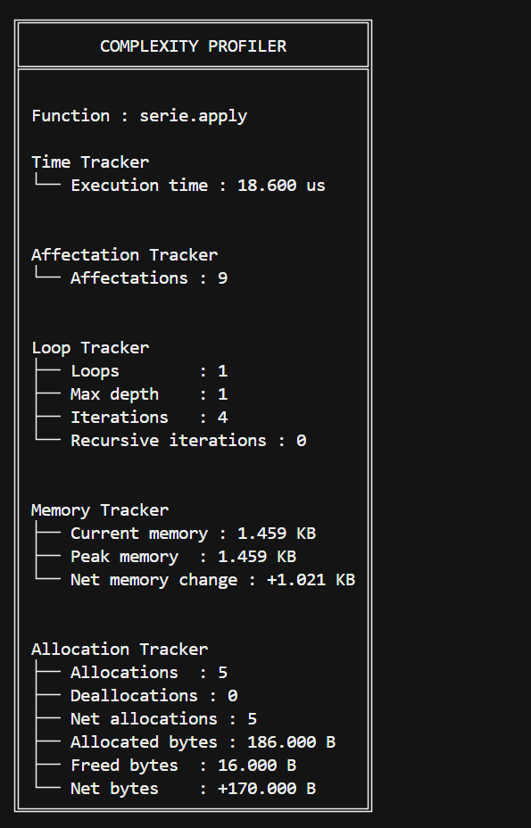

# Utils Docker Environment Setup

## Definition

This project provides a standardized, ready-to-run `Docker` setup for a Python CLI application, including an integrated debug workflow.

## Project

Reproduce three mathematical features (Factorial, Binomial Coefficient, and Custom Series) as practical computation targets.

The core value of the project comes from the `monitoring layer`, where each execution is profiled through dedicated trackers:

- `Time Tracker`: measures total execution duration.
- `Loop Tracker`: counts loop structures, max depth, and estimated iterations.
- `Affectation Tracker`: counts assignment operations performed by the algorithm.
- `Memory Tracker`: reports current, peak, and net memory usage during execution.
- `Allocation Tracker`: analyzes allocation/deallocation activity between snapshots.

This approach allow to analyze `complexity` and `optimization` behavior from an implementation perspective.

  






## Stack

- Python 3.12+
- Docker + Docker Compose
- `tracemalloc` (memory/allocation metrics)
- `ast` + `inspect` (static analysis for loops/affectations)
- `debugpy` (Cursor / VS Code debugger, local and Docker attach)

## Project Structure

```text
utils_docker_env_setup/
├── infra/
│   └── docker/
│       ├── Dockerfile
│       ├── compose.yml
│       └── compose.debug.yml
├── src/
│   ├── main.py
│   ├── mathematical/
│   │   ├── factorial.py
│   │   ├── binomial_coefficient.py
│   │   └── serie.py
│   └── monitor/
│       ├── complexity_runner.py
│       ├── report_generator.py
│       ├── dataclasses/
│       │   └── report.py
│       ├── types/
│       │   └── type_variables.py
│       └── trackers/
│           ├── tracker.py
│           ├── execution_time_tracker.py
│           ├── affectation_tracker.py
│           ├── loop_tracker.py
│           ├── memory_tracker.py
│           └── allocation_tracker.py
└── .vscode/
    └── launch.json
```

## Installation

No mandatory third-party package is required.

## Quick Start

### Local run

From the project root:

```bash
python src/main.py
```

### Docker run

Build the application image:
```bash
docker compose -f ./infra/docker/compose.yml build
```

Start the service with Compose:

```bash
docker compose -f ./infra/docker/compose.yml up app
```

Run the interactive CLI as a one-off container:

```bash
docker compose -f ./infra/docker/compose.yml run --rm app
```

### Docker debug

1. Start base + debug override (with port publication):

```bash
docker compose -f ./infra/docker/compose.yml -f ./infra/docker/compose.debug.yml run --rm --service-ports app
```

2. In Cursor/VS Code, launch `Python: Debug Docker`.

### Docker cleanup / purge

Use this as the default cleanup command:

```bash
docker system prune -f
```

Add options depending on the cleanup scope you need:

- `-f`: skip the confirmation prompt (non-interactive cleanup).
- `-a`: also remove unused images (not only dangling layers).
- `--volumes`: also remove unused Docker volumes.

Example for a full cleanup:

```bash
docker system prune -a --volumes -f
```

## VS Code / Cursor Debug

The `.vscode/launch.json` file includes:
- `Python: Debug Local`
- `Python: Debug Docker`

## Contact Information

For inquiries or feedback, please contact me at [alexisegea@outlook.com](mailto:alexisegea@outlook.com).

## Copyright

© 2026 Alexis EGEA. All Rights Reserved.